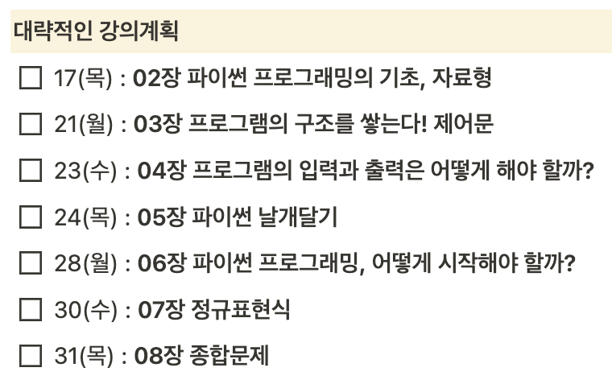

# PythonAlgorithmStudy

## 스터디 기간🚀
#### 2022.XX.XX ~ (미정)
##### 매주 X요일 XX:00 ~ XX:00

## 진행방식💻
- XX시
	- 매주 정해진 과제를 수행하고, 한 사람씩 돌아가면서 자신이 맡은 문제의 코드와 풀이 방식을 설명하고 질의응답.
---
## 스터디 참여 인원👩‍💻
- [**김규연**]()
- [**김강우**]()
- [**김민석**]()
- [**김도현**]()

---

---
## 주제와 문제집📖
| 주차 | 주제 |
|---|---|
|1/2 |	**파이썬 기초 공부** (Youtube/Codeup100제/백준입출력)   [나도코딩](https://youtu.be/kWiCuklohdY) [Codeup100제](https://codeup.kr/problemsetsol.php?psid=33) [백준입출력](https://www.acmicpc.net/workbook/view/10525)|
| 3  |  **수학** (합공식/피보나치수/약수/최대공약수/최소공배수/소수) :: XXX [문제집](https://www.acmicpc.net/workbook/view/8997) |
| 4  |  **자료구조** (스택/큐/덱/힙) :: XXX [문제집](https://www.acmicpc.net/workbook/view/8999) |
| 5  |  **재귀함수**의 이해 & 여러 가지 **정렬** :: XXX [문제집](https://www.acmicpc.net/workbook/view/9000) |
| 6  |  **다이나믹 프로그래밍 (DP)** :: XXX [문제집](https://www.acmicpc.net/workbook/view/9001) |
| 7  |  **그래프** 이론과 구현 (1) & **DFS와 BFS 기초** :: XXX [문제집](https://www.acmicpc.net/workbook/view/9003) |
| 8  |  **그래프** 이론과 구현 (2) & **DFS와 BFS 응용 & 다익스트라 알고리즘** :: XXX [문제집](https://www.acmicpc.net/workbook/view/9003) |
| 9  |  **분할정복 & 이분탐색**|
| 10 |  **그리디 알고리즘**|
| 11 |  **완전탐색(Brute Force) & 시뮬레이션** |
| 12 ~ | 카카오/삼성/네이버 등 기업 코딩테스트 문제 풀이  |

## 발표 문제🏆

|        |                      1                       |                         2                         |                          3                          |                           4                           |
| :----: | :------------------------------------------: | :-----------------------------------------------: | :-------------------------------------------------: | :---------------------------------------------------: |
| 3주  | [소수 찾기](https://www.acmicpc.net/problem/1978) | [소인수 분해](https://www.acmicpc.net/problem/11653) | [부분수열의 합](https://www.acmicpc.net/problem/1182) | [골드바흐의 추측](https://www.acmicpc.net/problem/9020) |
| 4주  | [후위 표기식2](https://www.acmicpc.net/problem/1935)| [큐](https://www.acmicpc.net/problem/10845) | [프린터](https://programmers.co.kr/learn/courses/30/lessons/42587)| [요세푸스 문제 0](https://www.acmicpc.net/problem/11866)  |
| 5주  | [하노이 탑](https://www.acmicpc.net/problem/1914) | [별 찍기 - 10](https://www.acmicpc.net/problem/2447) | [절댓값 힙](https://www.acmicpc.net/problem/11286) | [좌표 압축](https://www.acmicpc.net/problem/18870) |
| 6주  | [정수 삼각형](https://www.acmicpc.net/problem/1932) | [포도주 시식](https://www.acmicpc.net/problem/2156) | [가장 긴 증가하는 부분 수열](https://www.acmicpc.net/problem/11053) | [2xn 타일링 2](https://www.acmicpc.net/problem/11727) |
| 7주  | [트리 순회](https://www.acmicpc.net/problem/1991) | [순열 사이클](https://www.acmicpc.net/problem/10451) | [결혼식](https://www.acmicpc.net/problem/5567) | [단지번호 붙이기](https://www.acmicpc.net/problem/2667) |
| 8주  | [토마토](https://www.acmicpc.net/problem/7576) | [미로 탐색](https://www.acmicpc.net/problem/2178) | [적록색약](https://www.acmicpc.net/problem/10026) | [스타트링크](https://www.acmicpc.net/problem/5014)  |
| 9주  | [색종이 만들기](https://www.acmicpc.net/problem/2630) | [별 찍기 - 11](https://www.acmicpc.net/problem/2448) | [종이의 개수](https://www.acmicpc.net/problem/1780) | [예산](https://www.acmicpc.net/problem/2512) |
| 10주  | [병든 나이트](https://www.acmicpc.net/problem/1783) | [주식](https://www.acmicpc.net/problem/11501) | [신입 사원](https://www.acmicpc.net/problem/1946) | [통나무 건너뛰기](https://www.acmicpc.net/problem/11497) |
| 11주  | [도영이가 만든 맛있는 음식](https://www.acmicpc.net/problem/2961) |  [소수 찾기](https://programmers.co.kr/learn/courses/30/lessons/42839) | [카펫](https://programmers.co.kr/learn/courses/30/lessons/42842) | [후보 추천하기](https://www.acmicpc.net/problem/1713)  |
| 12주 |                                              |                                                   |                                                     |                                                       |

---
## 규칙👓
- 발표문제로 선정한 문제들을 **가급적** 다 풀 수 있도록 노력합니다.
- 만약 시간이 모자라는 등의 이유로 풀 수 없었다면, 발표 문제는 꼭 풀도록합니다. 
- 발표 문제로 나온 문제들은 **해당 주차 폴더/자신의 이름 폴더 밑에 문제번호.py**로 이름을 정해주세요.
	- 예시: gyuykim이 4주 발표 숙제로 11053번을 풀었다면, week4/gyuykim 위치에 11053.py로 소스코드를 저장해 커밋하면 됩니다. 	
	- Week4 
	  L gyuykim 
	  L 11053.py
- **커밋하고 푸시하기 전에 항상 pull을 먼저 해주시기 바랍니다.** 충돌을 방지하기 위함입니다.
- 더 풀어보실 만한 문제는 이 문서 상단의 '주제와 문제집' 표의 해당 주차의 문제집을 참고하시면 됩니다.
- 문제 풀이 발표 시간에는 
	- (1) 문제 번호
	- (2) 어떤 자료구조/알고리즘을 써야하는지
	- (3) 문제의 어떤 부분을 잘 읽어야 하는지 -> 문제의 실마리 잡기
	- (4) 코드의 시간복잡도
	- (5) 코드의 공간복잡도
	를 중심으로 설명합니다.
- 참고자료
	- <점프투 파이썬>,박응용 [위키독스링크](https://wikidocs.net/book/1)
	- <이것이 취업을 위한 코딩테스트다 with 파이썬>, 나동빈, 도서와 [유튜브 강의](https://www.youtube.com/playlist?list=PLRx0vPvlEmdAghTr5mXQxGpHjWqSz0dgC)
	- <알고리즘 문제풀이 시작하기> [블로그 링크](https://plzrun.tistory.com/entry/알고리즘-문제풀이PS-시작하기)
